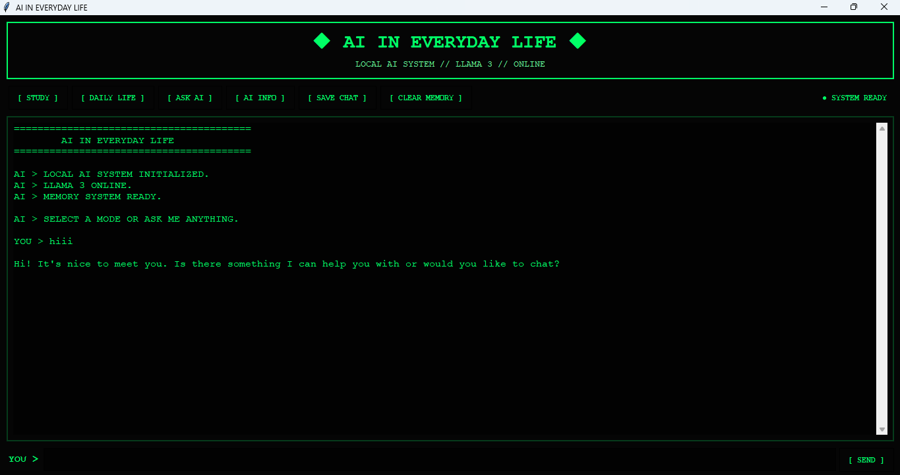

# 🤖 AI IN EVERYDAY LIFE


A simple desktop AI application built using Python, Tkinter, Ollama and Llama 3.

This project explores how Artificial Intelligence can be used in everyday situations while also providing an interactive local AI assistant.

---

## 📌 About the Project

AI is becoming a part of many everyday activities such as watching videos, using maps, shopping online, studying and using smartphones.

I created this project to understand how AI can be integrated into a real application using Python.

The application provides a retro-style interface where users can interact with a locally running AI model.

---

## ✨ Features

- 🤖 AI Chat Assistant
- ⚡ Streaming AI responses
- 🧠 Conversation memory
- 📚 Study Helper Mode
- 🌍 Daily Life AI Mode
- 💬 Ask AI Mode
- ℹ️ AI Information Panel
- 💾 Save conversations as text files
- 🗑️ Clear conversation memory
- 🎮 Retro-style graphical interface
- 🔒 Runs AI locally using Ollama

---

## 🛠️ Technologies Used

| Technology | Purpose |
|------------|---------|
| Python | Main programming language |
| Tkinter | Graphical User Interface |
| Ollama | Local AI runtime |
| Llama 3 | AI language model |
| Threading | Keeps the GUI responsive |
| Queue | Handles streaming responses |

---

## 🧠 How It Works

The application is built using Python and Tkinter.

When the user enters a question:

1. The question is added to the conversation history.
2. Python sends the conversation to Ollama.
3. Ollama runs the Llama 3 model locally.
4. The AI response is streamed back in small parts.
5. The response appears live in the chat window.
6. The conversation is stored in memory for future questions.

The Ollama Python library supports chat requests and streaming responses using `stream=True`.

---

## 🎮 Available Modes

### 📚 Study Mode

Helps explain educational topics using simple explanations and examples.

### 🌍 Daily Life Mode

Explores how AI is used in everyday situations.

Examples include:

- YouTube recommendations
- Google Maps
- Online shopping
- Smartphones
- Education
- Entertainment
- Language tools
- Accessibility

### 💬 Ask AI

Allows the user to ask the AI general questions.

### ℹ️ AI Info

Displays information about AI in everyday life and the technologies used in this project.

---

## 💻 Installation

### 1. Install Python

Download and install Python on your computer.

### 2. Install Ollama

Install Ollama and make sure it is running.

### 3. Download Llama 3

Open Command Prompt and run:

```bash
ollama pull llama3
